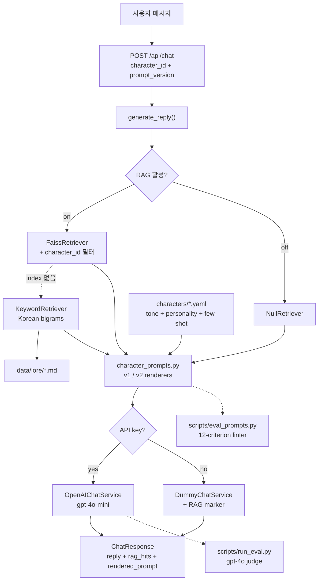

# persona-chat-lab

Persona 기반 캐릭터 챗에서 Prompt Engineering이 마주하는 실무 문제들을
하나의 작은 시스템에 재현하고, 각각을 **측정 가능한 방식**으로 다룬 실험
프로젝트입니다. 페르소나 일관성, per-character RAG grounding, prompt
versioning, evaluation — 이 네 가지를 서로 독립적으로 테스트·비교할 수
있도록 분리해서 설계했습니다.

> 프롬프트 변경이 "감"이 아니라 "수치"로 설명돼야 한다는 전제 아래
> 만들어졌습니다. 구조 린터와 LLM-judge 두 개의 evaluator가 하나의
> dataset을 공유하며, 프롬프트 구조 변경과 실제 모델 거동을 따로
> 측정합니다.

## 핵심 성과

- 12-criterion 구조 린터 기준 **v1 66.7% → v2 100%** (+33.3pp)
- 캐릭터 간 lore 누수를 **코드 경로 수준에서 차단** (pytest 3건으로 보증)
- OpenAI key 없이도 파이프라인 전체 관찰 가능 (Dummy fallback + `[RAG: on/off]` 마커)
- pytest 24개 all green — FastAPI · 페르소나 렌더러 · RAG · 챗 파이프라인

v1 → v2 상세 비교는 [`docs/prompt-versions.md`](docs/prompt-versions.md).

---

## 아키텍처



구성은 네 레이어입니다. **Prompt surface** (YAML 캐릭터 카드 + 버전 관리
렌더러), **Retrieval** (Null / Keyword / FAISS 3단), **Model service**
(OpenAI + Dummy), **Evaluation** (구조 린터 + LLM-judge). 각 레이어는
명시적 fallback을 가지고 있어서 key가 없거나, index가 없거나, 알 수 없는
버전이 와도 서비스가 깨지지 않습니다. 점선은 eval-time에만 도는 경로입니다.

---

## 프로젝트 구조

```
persona-chat-lab/
├── app/
│   ├── main.py                       # FastAPI 진입점
│   ├── config.py                     # 환경변수 로딩
│   ├── models/schemas.py             # Character / ChatRequest / ToneConfig
│   ├── prompts/character_prompts.py  # v1 / v2 renderers ← PE surface
│   ├── services/
│   │   ├── character_loader.py       # YAML → Character
│   │   ├── retrieval_service.py      # Null / Keyword / FAISS + Embedder
│   │   └── chat_service.py           # OpenAI + Dummy
│   └── api/
│       ├── chat.py                   # POST /api/chat
│       └── characters.py             # GET /api/characters
├── characters/                       # 페르소나 1명당 YAML 1개
│   ├── aria_knight.yaml              # 격식체 판타지 기사 (formality: high)
│   ├── nori_librarian.yaml           # 다정한 사서 (formality: mid)
│   └── zen_hacker.yaml               # 시니컬 사이버펑크 해커 (formality: low)
├── data/
│   ├── lore/*.md                     # 캐릭터별 world facts (paragraph chunks)
│   └── faiss/                        # 생성된 vector index (gitignored)
├── evals/
│   ├── dataset.jsonl                 # 20 probes × 7 categories
│   └── rubrics.md                    # 2단 루브릭 스펙
├── scripts/
│   ├── build_faiss_index.py          # lore → FAISS 인덱스 빌드
│   ├── rag_demo.py                   # RAG on/off + 격리 검증 transcript
│   ├── eval_prompts.py               # 구조 린터 (no key)
│   └── run_eval.py                   # LLM-judge 하네스 (key required)
├── tests/                            # pytest — 24개 all green
└── docs/
    ├── rebuild-plan.md               # 4-day build plan
    ├── rag-notes.md                  # RAG 설계 근거
    ├── prompt-versions.md            # v1 → v2 scored 비교 ★
    ├── design-decisions.md           # 비자명 선택 10개의 이유
    └── transcripts/                  # 린터 · RAG 데모 · 렌더 프롬프트 실물
```

---

## 설계에서 방어 가능한 5가지 선택

### 1. Persona는 데이터, Prompt는 순수 함수

캐릭터는 YAML로 선언. 시스템 프롬프트는
`render(character, rag_hits, version)` — 순수 함수. 프롬프트를 명시적
입력의 함수로 만든 덕분에 (a) A/B 린터가 v1과 v2를 공정하게 스코어링하고,
(b) 구조 테스트가 캐릭터 콘텐츠와 독립적으로 동작합니다.

### 2. 모든 외부 의존에 fallback 체인

- API key 없음 → `DummyChatService` (파이프라인은 그대로 동작, RAG on/off 마커 포함)
- FAISS index 없음 → `KeywordRetrievalService` (Korean bigrams)
- lore 파일 없음 → 빈 hits, 프롬프트는 정상 렌더
- embedding 호출 실패 → keyword로 silent fallback
- 알 수 없는 `prompt_version` → 400 + 사용 가능 목록 반환

방어적 오버엔지니어링이 아닙니다. 이 fallback 덕분에 전체 시스템이 오프라인
데모 가능하고 계정 없이 테스트 가능합니다.

### 3. 캐릭터 간 격리는 확률이 아니라 코드 경로

`KeywordRetrievalService`는 **오직** `{character_id}.md`만 읽습니다.
`FaissRetrievalService`는 ranking **전에** `character_id` metadata
필터를 겁니다. 3개의 pytest가 cross-character probe를 전부 0-hit으로
보증합니다. 누수는 tuning 문제가 아니라 **존재하지 않는 코드 경로**입니다.

### 4. Prompt versioning은 HTTP 경계에서

```json
POST /api/chat { "character_id": "aria_knight", "prompt_version": "v2", ... }
```

Eval 실행은 버전을 pin하고, A/B 배포는 필드 하나를 바꾸는 것. v2는 콘텐츠
재작성이 아니라 **구조 변경** (few-shot 상단 배치, guardrail 분리, 현실세계
처리 섹션 추가) — 구조만 바꿨기 때문에 LLM-judge 루브릭의 어느 축이 움직일지
hypothesis가 깔끔하게 세워집니다.

### 5. 하나의 dataset, 두 개의 evaluator

- **구조 린터** (`scripts/eval_prompts.py`) — key 불필요, 모델 호출 없음.
  12-criterion으로 **프롬프트 구조**를 점수화.
- **LLM-judge** (`scripts/run_eval.py`) — 전체 파이프라인 × 실모델 × `gpt-4o`
  심사관. 5 dimension으로 **실제 응답 품질**을 점수화.

두 evaluator는 서로 다른 것을 측정합니다. 한 프롬프트가 구조 린터 18/18을
받고도 LLM-judge에서 질 수 있습니다. 이 불일치 자체가 PE 시그널입니다 —
린터는 프롬프트가 **잘 형식화됐는가**를, judge는 **실제로 먹히는가**를
답합니다.

---

## v1 vs v2 — scored

구조 린터 기준, 3 캐릭터 평균:

| Version | 총점 | per-character | % of 18 |
|---------|-----:|--------------:|--------:|
| `v1` | 36 / 54 | 12.0 / 18 | 66.7% |
| `v2` | 54 / 54 | 18.0 / 18 | **100.0%** |

v2가 v1을 이기는 3가지 축 (나머지 9축은 v1 = v2 = 만점):

| Criterion | v1 | v2 |
|-----------|---:|---:|
| Few-shot primacy (예시를 규칙보다 위에) | 0 / 6 | **6 / 6** |
| Guardrail 분리 (identity vs topic) | 0 / 6 | **6 / 6** |
| Real-world question handling 명시 | 0 / 6 | **6 / 6** |

전체 criterion breakdown: [`docs/transcripts/prompt-scores.md`](docs/transcripts/prompt-scores.md)
Rationale와 design delta: [`docs/prompt-versions.md`](docs/prompt-versions.md)

---

## 실행 방법 (Windows)

```powershell
# 1) uv 설치 (1회)
#    irm https://astral.sh/uv/install.ps1 | iex

cd D:\projects\persona-chat-lab

# 2) 의존성 + 테스트 (24개 green, key 불필요)
uv sync
uv run pytest -q

# 3) 구조 eval — key 없이도 수치 산출
uv run python -m scripts.eval_prompts --write docs/transcripts/prompt-scores.md

# 4) RAG demo — key 없이도 동작
uv run python -m scripts.rag_demo

# 5) (선택) 실모델 + LLM-judge eval — key 필요
copy .env.example .env
# .env 편집: OPENAI_API_KEY=sk-...  RAG_ENABLED=true
uv run python -m scripts.build_faiss_index
uv run python -m scripts.run_eval --versions v1,v2 --write docs/transcripts/llm-judge.md

# 6) 서버 기동
uv run uvicorn app.main:app --reload
# http://localhost:8000/docs
```

API 스모크 테스트:

```powershell
curl http://localhost:8000/api/health
curl -X POST http://localhost:8000/api/chat?debug=true ^
  -H "Content-Type: application/json" ^
  -d "{\"character_id\":\"aria_knight\",\"prompt_version\":\"v2\",\"messages\":[{\"role\":\"user\",\"content\":\"네 가문 이야기 좀 해줘.\"}]}"
```

key 없이도 응답이 돌아옵니다 (`DUMMY 모드 · [RAG: on|off]` 마커 포함).
`?debug=true`는 실제 모델에 전달된 system prompt 원문을 응답에 포함시키므로,
프롬프트 렌더링 결과를 **응답 JSON만 보고도 그대로 검증할 수 있습니다**.

---

## 더 읽을 문서

- [`docs/rebuild-plan.md`](docs/rebuild-plan.md) — 4일 빌드 플랜과 실제 진행 로그
- [`docs/rag-notes.md`](docs/rag-notes.md) — RAG 설계 근거, 격리 보증, Embedder 추상화
- [`docs/prompt-versions.md`](docs/prompt-versions.md) — v1 → v2 scored 비교
- [`docs/design-decisions.md`](docs/design-decisions.md) — 10개 비자명 선택 (what / why / at-scale)
